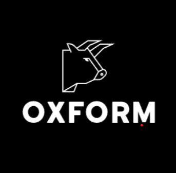

# Welcome to OxForm🐂
### ETH-PARIS Hackathon Submission 🚀🧑‍🚀

---

### Description:
OxForm is a cutting-edge web3 platform revolutionizing data collection and verification. It integrates Sismo and Worldcoin for sybil-resistant verification and zero-knowledge proofs, ensuring genuine user participation and data reliability. Contributors are incentivized through rewards and token minting, fostering valuable data submissions. Optimistic validation streamlines the process, enhancing efficiency and trust. With secure data storage on IPFS and Filecoin, OxForm maintains data integrity and transparency. Empowering users to contribute trustworthy data forms, surveys, and datasets, OxForm facilitates data-driven decision-making across industries. Embrace the future of decentralized data with OxForm.

### Problem Statement:
Current data collection methods in web2 (e.g., Google Forms, Typeform) and web3 environments face challenges in data reliability, authenticity, and user incentivization. Centralized platforms lack robust identity verification, leading to inaccuracies and data manipulation. Web3 complexities, like sybil-resistant verification and zero-knowledge proofs, hinder transparent and trustworthy data sources. A comprehensive, incentivized data collection solution is needed to bridge the gap between traditional and decentralized ecosystems.

### Solution:
The OxForm Protocol addresses these challenges by integrating Sismo and Worldcoin for user verification and zero-knowledge proofs to protect data. Optimistic validation streamlines submissions, while rewards and token minting incentivize valuable contributions. The seamless integration fosters a reliable data collection environment. With secure data storage on IPFS and Filecoin, OxForm ensures data integrity, becoming a trusted platform for data forms, surveys, and datasets. Embrace a data-driven future with OxForm.

---
### Technologies we used
---
#### SISMO :
The platform integrates Sismo as an on-chain global verifier, enabling form creators to select specific Sismo factory groups. These groups restrict submissions to verified users, fostering a high-quality and trustworthy data environment. Additionally, a Worldcoin group permits only Worldcoin Soulbound ERC721 token holders to submit data on forms.
- [GlobalOnChainVerifier](https://github.com/tse-lao/hackParis/blob/main/contracts/contracts/sismo/sismoGlobalVerifier.sol )
- [SismoConnect](https://github.com/tse-lao/hackParis/tree/main/client-app/components/custom/sismo)
#### WORLDCOIN :
OxForm utilizes an on-chain Worldcoin verifier to mint one-time Soulbound ERC721 tokens for verified humans. These tokens generate zero-knowledge proofs with Sismo for human verification within the Forms contracts.

- [Contract](https://github.com/tse-lao/hackParis/blob/main/contracts/contracts/Worldcoin/WorldcoinSoulboundToken.sol    )
- [WidgetCode](https://github.com/tse-lao/hackParis/blob/main/client-app/components/custom/worldcoin/Worldcoin.tsx)
#### FILECOIN & IPFS :
OxForm securely stores form metadata and submissions on decentralized networks IPFS and Filecoin through Lighthouse. Data is encrypted and token-gated to Form NFT holders, incentivizing contributors through token rewards and encouraging interested parties to decrypt and access the submissions.
- [Lighthouse implementation](https://github.com/tse-lao/hackParis/blob/main/backend/src/files/files.service.ts)
#### UMA V3 :
The OxForm Protocol successfully implements UMA's custom escalation manager, enabling dispute resolution and a community-based voting system. This integration, combined with ZK proofs from Worldcoin and Sismo, empowers verified users to decrypt and dispute form submissions, enhancing data quality and integrity. Contributors receive NFT mints as rewards for successful submissions.
- [UMA_Contracts](https://github.com/tse-lao/hackParis/tree/main/contracts/contracts/UMA     )
- [BackendIntegration](https://github.com/tse-lao/hackParis/tree/main/backend/src/uma)
#### THE GRAPH :
Custom subgraphs are deployed to index events from OxForm and OxOptimisticForm contracts, along with redeploying the UMA subgraph on the Mumbai testnet. These subgraphs ensure a seamless application experience, supporting platform functionality during the hackathon.
- [0xForm_Graph](https://api.studio.thegraph.com/query/50124/forms/v0.1)
- [0xOptimisticForm_Graph](https://api.studio.thegraph.com/query/50124/voteforms/version/latest)
- [new UMAmumbaiGraph](https://api.studio.thegraph.com/query/50124/umamumbai/version/latest)

#### WALLET CONNECT :
OxForm employs Wallet Connect for secure user authentication, ensuring a seamless and user-friendly experience during platform access.
- [WalletConnect implementation](https://github.com/tse-lao/hackParis/blob/main/client-app/app/App.tsx)
#### XMTP :
OxForm incorporates XMTP to provide a chat layer atop forms, enabling interested form buyers to gain insights into data usefulness through feedback and interactions.
- [XMTP implementation](https://github.com/tse-lao/hackParis/blob/main/client-app/app/profile/%5Baddress%5D/page.tsx)

---
####  Use Cases for OxForm :
- Decentralized Surveys and Feedback Forms : OxForm can be utilized to create decentralized surveys and feedback forms, allowing businesses, organizations, and individuals to collect valuable insights from a global and diverse user base.
- Academic Research and Data Collection :       Researchers and academic institutions can leverage OxForm to conduct decentralized data collection for research studies, ensuring data authenticity and transparency.
- Market Research and Customer Feedback: Businesses can use OxForm to gather market research data and customer feedback, enabling them to make data-driven decisions and improve their products or services.
- Reward-Based Content Creation: Content creators can use OxForm to engage their audience and reward them for providing valuable feedback or contributions, fostering an active and loyal community.
- Decentralized Human Resource Applications: OxForm can be employed for decentralized job applications, interviews, and candidate evaluations, ensuring transparency and fairness in the hiring process.
---
#### CONTRACTS
---
- [WorldcoinSoulboundToken](https://mumbai.polygonscan.com/address/0x646e10C6B1337c08D8464bB9f73C6F01e82Bf2e9#code)
- [SismoGlobalVerifier](https://mumbai.polygonscan.com/address/0x9A84aA1594F6EFd15bb93BC75b958AaC0AEcFe05#code)
- [0xForm](https://mumbai.polygonscan.com/address/0x407e7f38571D4772C84AAa40BF56d9850059Daa6#code)
- [0xOptimisticForm](https://mumbai.polygonscan.com/address/0x41bD4839ca2180282d35e7b01CDFeEDB16EEefB8#code)
    - [OxOptimisticFormEscalationManager](https://mumbai.polygonscan.com/address/0xFF4B6BF7c9eBFE1cc5b1E47c09D3290439735C25#code)

#### Contracts Deployment Full WorkFlow Scripts.
- [WorldCoinSoulboundToken](https://github.com/tse-lao/hackParis/blob/main/contracts/deploy/00_deploy_WorldcoinSoulboundToken.js)
- [OxForm](https://github.com/tse-lao/hackParis/blob/main/contracts/deploy/01_deploy_OxForm.js)
- [OxOptimisticForm](https://github.com/tse-lao/hackParis/blob/main/contracts/deploy/02_deploy_OxOptimisticForm.js)
